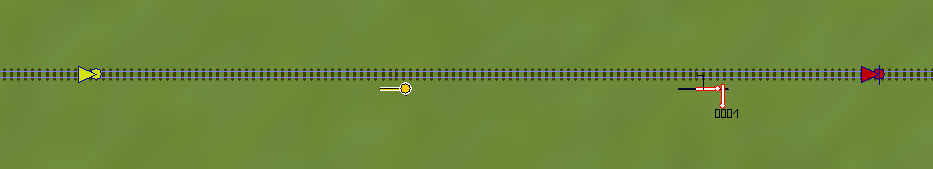

# KsKit für Eisenbahn.exe

KsKit ist eine Sammlung von Lua-Funktionalität, welche ich auf meinen Anlagen für eine vorbildgerechte Signalisierung einsetze.
Die hier geschilderten Anwendungsfälle und Programmschnipsel stellen kein Komplettpacket dar, sondern sind eher wie ein Kuchen anzusehen, aus denen man sich ein paar Rosinen herauspicken darf.

Aus dem Basisscript dürfen Teile entnommen werden und anderswo verwendet werden, dabei ist die Herkunft und Versionsnummer zu nennen, z.B. als Quellcode-Kommentar.
Die Versionsnummer befindet sich am Anfang des Basisscripts und kann über die Variable `KsKitVer` abgefragt werden.

## Einrichtung

Das KsKit-Verzeichnis wird im EEP-Stammverzeichnis, dort im LUA/ Unterverzeichnis als ganzes hin entpackt.


Die Einbindung vom Anlagenscript aus erfolgt mittels `require("kskit")`.

**Wichtig**: Wenn KsKit verwendet wird, darf keine EEPMain definiert sein. 

Findet EEP die Dateien von Lua nicht, wird im Ereignisfenster eine Liste von Orten ausgegeben, an denen die Dateien gesucht wurden.
Die Orte sind in diesem Fall mit dem Installationsort abzugleichen.

## Allgemeine Hauptsignale

Damit KsKit ein Modell als Hauptsignal ansteuern kann, muss das Signalmodell über eine funktionierende Haltstellung verfügen.
Trotz "Ks" im Namen ist KsKit in der Lage, Signalmodelle unabhängig vom Signalsystem anzusteuern.

Um ein Signal ohne besondere Funktion in KsKit einzutragen, wird die Funktion `Basissignal` verwendet:

```
Basissignal(39, 1)
```

Der erste Parameter ist die ID-Nummer des Signals, der zweite Parameter ist die Haltstellung.
Als Haltstellung verwenden die meisten Signalmodelle die 1, es gibt allerdings Ausnahmen.

Das Aufrufen dieser Funktion legt die notwendigen Callbacks und Funktionen für das Signal an.
Daher darf die Funktion nur einmal während der Initialisierung des Lua-Scriptes aufgerufen werden, nicht aus der EEPMain, MainFunktionen oder vergleichbaren heraus.



### Signalzugschlussstalle

Für jedes Hauptsignal muss eine Signalzugschlussstelle existieren.
Als Signalzugschlussstelle dient ein Signalkontakt (rot), welcher nach der Überfahrt eines Signals dieses wieder auf den Haltbegriff zurücksetzt.
Dieser Kontaktpunkt befindet nach dem Signal am Ende des Durchrutschweges.

Die Bezeichnung als Zugschlussstelle ist historisch gewachsen, in Epoche V und VI löst die erste Achse des Zuges durch Befahren eines Gleisfreimeldeabschnittes die Rotschaltung aus.
Das Einstellen auf 'Zugschluss' ist daher nicht notwendig.

An dem Signalkontakt muss keine Lua-Funktion eingetragen werden.
Auch die Wirkrichtung muss nicht beschränkt werden, dies bietet sich aber an, damit man über das Kontakt-Symbol leichter erkennen kann, in welcher Richtung das dazugehörige Signal steht.

### Anmelde-Kontakt

Optional zu einem jeden Hauptsignal kann ein Anmeldekontakt verwendet werden.
Ein Anmeldekontakt kann ein Kontakt jeglicher Art sein, an dem die Lua-Funktion "Anmeldung_X" eingetragen wird.
Anstelle "X" wird die ID-Nummer des folgenden Signales eingetragen.

EEP überprüft bei dem Eintragen der Lua-Funktion, ob diese auch existiert, daher kann dieser Kontakt erst korrekt eingerichtet werden, nachdem EEP die `Basissignal`-Funktion ausgeführt hat, z.B. durch Wechsel in den 3D-Modus.

Der Anmelde-Kontakt sollte eingerichtet werden, wenn das vorherige Signal keine automatische Anmeldung durch Weiterschaltung des Zugnamens durchgeführt hat.
Dies trifft auch zu, wenn es kein vorheriges Signal gibt, weil es sich um eine Aufgleisstrecke, eine Ausfahrt eines virtuelles Depots oder um einen ungesicherten Anlagenbereich handelt.

Wird keine Anmeldung durchgeführt und fährt ein Zug unangemeldet an einem logischen Vorsignal vorbei, wird die Anmeldung am jeweiligen Hauptsignal nachgeholt.

Wer sich nicht daran stört, das Signale erst nach Überfahrt des Vorsignales auf Fahrt schalten, kann auf Anmeldungen generell verzichten.

## Lua-Kniffe

Bei der Entwicklung des Basisscriptes haben sich einige Mechanismen als sehr praktisch erwiesen, um die Komplexität des Codes im Zaum zu halten.

Wer auf das KsKit aufbauend noch weitere Funktionalität scripten möchte, sollte sich die folgenden Sektionen zu Rate ziehen.

### Mainfunktionen

Das Basisscript bringt eine eigene EEPMain mit, daher darf von Seiten des Anlagen-Scriptes keine weitere EEPMain definiert werden.
Soll Lua-Code im Rahmen der EEPMain ausgeführt werden, wird mittels MainFunktion() eine Lambda-Funktion registriert.
Als Argument wird eine Funktion übergeben, welche keine Argumente nimmt.
Diese Funktion wird dann in jedem Zyklus einmal aufgerufen.

Dies entspricht dem Beobachter-Muster in der professionellen Softwareentwicklung.
Anstatt in einer zentralen Stelle alle zu informierenden Ziele aufzulisten, kann die EEPMain von verschiedenen Stellen im Quellcode aus "abonniert" werden.

```
MainFunktion(function()
  if EEPGetSignalTrainsCount(1) > 0 then
    EEPSetSignal(1, 1, 1)
   end
end)
```

Dieser Programmcode bindet eine Funktion an die EEPMain.
Die Funktion fragt ab, ob vor einem Signal ein Zug steht und schaltet in diesem Falle das Signal auf Fahrt.

### Signalfunktionen

Analog zu den Mainfunktionen ergibt sich ein ähnliches Problem mit den Signal-Callbacks.
Ein herkömmlicher Signal-Callback kann nur an einer einzigen Stelle definiert werden.
An einigen Stellen ist es jedoch notwendig, das mehrere Stellen über ein Umschalten eines Signals informiert werden wollen.

Mittels der SignalFunktion kann eine Funktion an ein Signal angebunden werden.
Als erstes Argument bei der Anbindung wird die ID des Signales angegeben.
Dabei kann es sich auch um ein Fahrstraßen-Signal handeln.
Als zweites Argument wird eine Funktion eingetragen, welche als erstes Argument die neue Stellung übergeben bekommt.

Der Mehrwert ist schnell ersichtlich: Waren bisher alle zu informierenden Vorsignale, Bahnschranken und dergleichen. in der EEPOnSignal_X() einzutragen, können sich die für die Vorsignale oder Bahnübergänge verantwortlichen Code-stellen nun selbstständig als "Abonnenten" der Signalstellung eintragen.

Als Beispiel wird eine Signalfunktion definiert, welche lediglich die neue Stellung eines Signals ausgibt:

```
SignalFunktion(1, function(Stellung)
  print("Signal auf ", Stellung, " umgestellt")
end)
```
