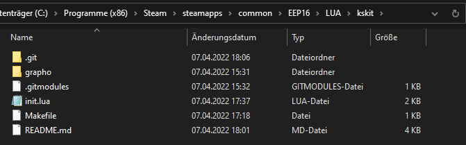
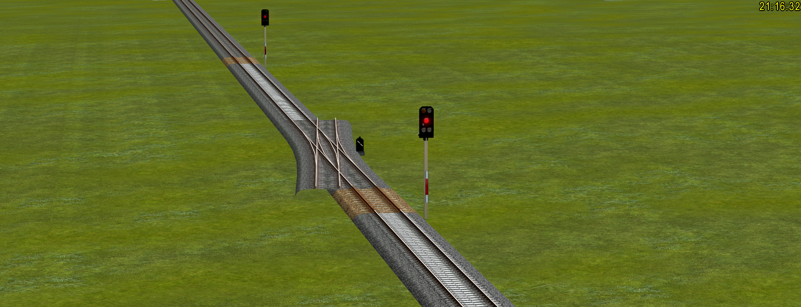
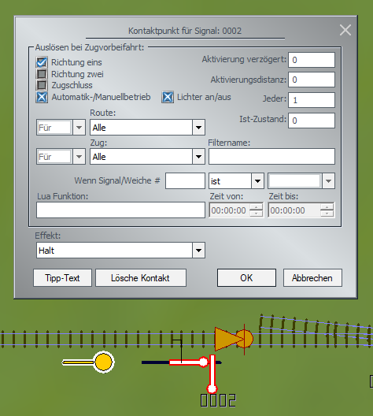
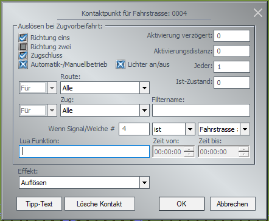

# KsKit für Eisenbahn.exe

KsKit enthält Steuer-Code für ESTW-basierende Strecken- und Bahnhofsanlagen.
Epochenmäßig liegt der Fokus auf Bahnanlagen der Epoche VI.
Die Vorbildsituation ist dem Bahnhof Bad Schandau entnommen.

Der Hauptanwendungsfall sind Anlagen mit realistischen Entfernungen und vorbildnaher Streckenausstattung.
Daher enthält die Dokumentation auch Richtlinien zur Platzierung der Streckenaustattung.

## Übersicht über ähnliche Werke

["Automatic Train Control"](https://github.com/FrankBuchholz/EEP-LUA-Automatic-Train-Control) von Frank Buchholz und RudyB ist eine jüngere Lösung.
Hier merkt sich Lua, welche Weichen und Signale durch den Fahrweg eines Zuges blockiert sind.
Über eine Browseranwendung lassen die Definitionen für Lua direkt aus der Anlagendatei generieren.
Die Ausstattung der Strecken mit Fahrstraßensignalen und Kontakten ist nur minimal notwendig.
Die Dokumentation erfolgt über eine mitgelieferte PDF.
ATC eignet sich am besten für EEP-Bahner, welche nicht die Zeit oder Energie haben, sich in Lua einzuarbeiten.

Das Rundum-Sorglos-Packet von Parry36 ist die alteingewachsene Lösung.
Über die EEP-Eigenen Fahrstraßen wird hier die Zugsicherung realisiert.
Die Signale und Fahrstraßen werden über Tabellen ins Lua eingetragen.
Signalbeeinflussung findet über Kontakte statt.
Auf Youtube gibt es eine Anzahl von Video-Tutorials, wo man ihm beim Anwenden von RUS zusehen und nachmachen kann.
Allerdings sind dafür schon einige Lua-Kenntnisse notwendig.
Teile des RUS, z.B. die P36_Toolbox, sind auch alleinstehend nutzbar.
Das RUS ist gut geeignet für Lua-Bastler, welche Wert auf einen komplexen Bahnbetrieb legen.

KsKit basiert wie RUS auf den EEP-Fahrstrassen, ist aber auf die Ansteuerung von den Ks-Signalen von GK3 konzentriert.
Anders als bei den anderen beiden Frameworks werden Signale und Fahrwege nicht über eine Tabelle, sondern über Funktionsaufrufe bei der Lua-Initialisierung definiert.
Dabei sind sehr viele Informationen anzugeben, welche dann aber auch Signalschaltungen ermöglichen, welche bei RUS und ATC nicht möglich sind.
KsKit empfiehlt sich für EEP-Bahner, welche auf ihrer Anlage eine vorbildgerechte Vor- und Mehrabschnittsignalisierung realisieren wollen.
Fortgeschrittene Erfahrungen mit Lua sind dafür unerlässlich.
Ebenfalls ist die Lektüre von "Sicherung des Schienenverkehrs", Ulrich Maschek, Springer Vieweg zu empfehlen.

Diese Dokumentation behandelt ausschließlich KsKit.
Die Sektionen für die vorbildgerechte Platzierung der Streckenaustattung und Kontakte sind unabhängig von der verwendeten Lua-Lösung lesenswert.

## Einrichtung

Das KsKit-Verzeichnis wird im EEP-Stammverzeichnis, dort im LUA/ Unterverzeichnis als ganzes hin entpackt.



Die Einbindung vom Anlagenscript aus erfolgt mittels `require("kskit")`.

Findet EEP die Dateien von Lua nicht, wird im Ereignisfenster eine Liste von Pfaden ausgegeben, an denen die Dateien gesucht wurden.
Diese Pfade sind in diesem Fall mit dem Installationspfad abzugleichen.

## Platzierung von Hauptsignalen

Bei der Platzierung von Hauptsignalen ist eine Reihenfolge einzuhalten:

- Haltebereich
- Signalstandort
- Durchrutschweg
- Gefahrenbereich wie z.B. Weichen, offene Strecke falls vorhanden



Im Haltebereich hält ein Zug, wenn das Signal einen Haltbegriff zeigt.
Dabei muss auf die Länge geachtet werden.
Speziell in Bahnhöfen könnte es passieren, das der Haltebereich für einen Zug nicht lang genug ist und dieser teilweise noch in den Weichen des Einfahrweges steht.

Zwischen Haltebereich und Signalstandort kann ein Zwischenraum gehalten werden.
Dieser kann im Signal-Dialog unter "Halteabstand" in Metern angegeben werden.
Dies entspricht der Situation beim Vorbild, wo Züge ja nicht direkt am Signal, sondern etliche Meter davor stehen.

Der Durchrutschweg dient beim Vorbild als Pufferzone, falls ein Zug es nicht schafft, rechtzeitig am Signal zu halten.
Beim Vorbild ist dieser Bereich bis zu 200 Meter lang.
Da EEP in der Lage ist, Züge "sofort" anzuhalten, ist der Durchrutschweg nicht zwingend notwendig und kann auf Spielanlagen oder in Schattenbahnhöfen weggelassen werden.

Der Gefahrenbereich ist in den meisten Fällen der Weichenbereich im Bahnhofskopf.
Alternativ kann es sich auch um eine niveaugleiche Kreuzung oder ein bewegliches Brückenelement handeln.
Ebenfalls gehört der folgende Streckenabschnitt zum Gefahrenbereich, da sich hier noch ein Zug befinden könnte, sowie der Haltebereich des darauffolgenden Hauptsignales.

### Haltstellungskontakt

Um die Sicherheit der Signalschaltungen zu gewährleisten, ist es notwendig, jedes Hauptsignal mit einen Haltstellungskontakt zu versehen.



Der Haltstellungskontakt wird im Bereich des Durchrutschweges platziert, also in etwas Abstand hinter dem Signal.

## Fahrstrassen

Eine Möglichkeit zur Sicherung von Streckenabschnitten besteht in der Verwendung der EEP-eigenen Fahrstraßenfunktionalität.

Auf das Anlegen der Fahrstrassen wird hier nicht weiter eingegangen, dies kann im EEP-Handbuch nachgeschlagen werden.

Das FS-Startsignal sollte sich, wie in den Tutorials beschrieben, nicht allzu weit nach dem Hauptsignal befinden.

### Fahrstrassenzugschluss

In den offiziellen Tutorials wird das FS-Endsignal vor das darauffolgende Hauptsignal platziert.

Der Bereich zwischen FS-Startsignal und FS-Endsignal wird allerdings nicht überwacht.
Befindet sich der Haltepunkt des Signales nach dem FS-Startsignal, kann sich in dem dazwischenliegenden Bereich ein kurzes Fahrzeug verstecken und wird mit großer Wahrscheinlichkeit von dem nächsten Durchgangszug gewaltsam "aufgegabelt".

Ebenfalls löst das Heranfahren an das Signal die Fahrstrasse auf, selbst wenn der Zugschluss noch im Weichenbereich steht.
Besonderer Fahrstraßenausschlüsse, z.B. für Kreuzungen, wirken dann nicht mehr.

Wem das so nicht gefällt und den Mehraufwand nicht scheut, kann das FS-Endsignal auch nach dem Hauptsignal platzieren.
Der nicht überwachte Bereich ist dann im Durchrutschweg.
Befindet sich ein kurzes Fahrzeug in dem nicht überwachten Bereich, befindet sich dieses gerade auf der Fahrt in den Folgeabschnitt und entkommt somit der Aufgabelung durch den Zug.

Dies hat den Nachteil, das die Fahrstrasse dann erst nach Abfahrt des Zuges aufgelöst wird.
Dadurch bleibt die Einfahrtweg auch für andere Züge versperrt.
Davon betroffen sind FS-Startsignale, welche mehr als eine Fahrstrasse zu einem Zielsignal besitzen.
Dies ist eine typische Situation für Fahrstraßen nach Einfahrsignalen.

Dem kann abgeholfen werden, indem am Ende des Weichenbereiches ein Signalkontakt angelegt wird, welcher die Fahrstraße auflöst.
Der Kontakt muss so eingestellt werden, das er nur bei Zugschluss wirkt.
Führen mehere Fahrstraßen über den Kontakt, muss für jede Fahrstrasse ein eigener Kontakt angelegt werden.
Die Kontakte müssen so eingestellt werden, das sie nur wirken, wenn die dazugehörige Fahrstraße gerade geschaltet ist.



### Fahrstrassen mittels Lua

Es ist möglich, Fahrstraßen über Lua zu implementieren.
Das Lua-Script ["Automatic Train Control"](https://github.com/FrankBuchholz/EEP-LUA-Automatic-Train-Control) macht das z.B. so.

Lua-basierende Fahrstraßen sind nicht direkt über das Gleisbildstellpult ansteuerbar und sind daher nicht sonderlich offen für das händische Eingreifen in den Bahnbetrieb.
Sie sind eher für reine Automatikanlagen geeignet.

Die folgenden Kapitel beziehen sich auf die Fahrstraßensignale, die EEP anbietet.

## Auswahl von Signalmodellen

Bei den Signalmodellen wird hier zwischen binären, mehrbegriffige und komplexen Signalmodellen unterschieden.
Binäre Signalmodelle haben lediglich zwei Stellungen und sind mittels Fahrstrassen einfach zu managen.
Ebenfalls passen sie gut zum EEP-Gleisbildstellpult, da dieses nur zwei Stellungen pro Signal anzuzeigen vermag.

Mehrbegriffige Signalmodelle haben, wie es der Name schon sagt, mehere Begriffe, die auch Geschwindigkeitsabstufungen erlauben.

Komplexe Signalmodelle verfügen über weitere Stellungen für Vorsignalisierung des folgenden Hauptsignale oder gesonderte Abfahrtsbefehle.
Für eine Vorbildgerechte Ansteuerung muss hier auf Lua zurückgegriffen werden.

### Einabschnittsignale

#### Blocksignale

### Mehrabschnittssignale


## EEPMain und Callbacks

KsKit übernimmt die Entgegennahme sämtlicher Callbacks und erlaubt es, mehrere Funktionen durch einen EEP-Callback auszuführen.

Das bedeutet allerdings auch, das im Anlagenscript keine EEPMain, EEPOnSignal und EEPOnSwitch zu definieren sind.
Als Ersatz dafür bietet KsKit eine eigene Schnittstelle an:

```
Main(function()
  print("Main")
  -- return-Wert von hier wird ignoriert
end)

OnSignal(1, function(Stellung)
  print("Signal 1 zeigt jetzt Stellung ", Stellung)
end)

OnSwitch(2, function(Stellung)
  if Stellung == 1 then
    print("Weiche 2 ist auf Durchfahrt gestellt")
  elseif Stellung == 2 then
    print("Weiche 2 ist auf Abzweig gestellt")
  elseif Stellung == 3 then
    print("Weiche 2 ist auf Coabzweig gestellt")
  end
end)
```

Auf diese Art definierte Callbacks dürfen beliebig wiederholt werden.
Ruft EEP den Callback auf, werden alle dazu eingetragenen Funktionen aufgerufen.

Die Anmeldung bei EEP durch die `EEPRegister...` Funktionen wird von KsKit automatisch vorgenommen.
