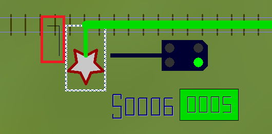

# KsKit für Eisenbahn.exe

KsKit sollte ursprünglich eine Vollumfassende Lösung für viele Lua-Verschaltungen in EEP werden.
Während der Entwicklungszeit bildete sich heraus, das für viele Lösungen nur wenig oder gar kein Lua notwendig ist.
Daher ist die "Kernarbeit" von KsKit diese Dokumentation.
Vorgehensweisen, welche keine KsKit-Scripte benötigen, können auch auf Anlagen mit dem RUS-Packet oder Automatic Train Control angewendet werden.

Derzeit ist noch alles etwas im Flux, wenn du vom EEP Forum hierhergefunden hast, warte bitte ab bis ich offizielle Ankündigungen mache.

Alle Scripte können [hier](https://github.com/nero/kskit/archive/refs/heads/master.zip) als Zip-Datei heruntergeladen werden, die lässt sich dann wie ein Modell installieren.
Die Teilscripte werden in den LUA-Ordner im EEP-Stammverzeichnis installiert.

## Fahrstrassen

Fahrstrassen bestehen aus jeweils einem Start- und Endsignal und haben eine Liste von Fahrwegelementen:

Der Fahrweg einer Fahrstraße besteht aus beliebigen Splines, meist jedoch Gleise.
Pro Spline kann dabei nur maximal eine Fahrstraße aktiv geschalten sein.
Wird versucht, eine Fahrstraße zu schalten, deren Fahrweg von einer anderen Fahrstraße besetzt ist, hat der Schaltversuch keine Wirkung.
Das selbe gilt auch, wenn die Splines einer Fahrstraße von Rollmaterialien besetzt sind.
Dies wird beim Vorbild als Fahrstrassenausschluss bezeichnet.
Beim Bearbeiten im 2D-Modus werden die Splines einer Fahrstraße Fahrstraße mit einer einfarbigen Linie überzeichnet, um ihre Zugehörigkeit anzuzeigen.

Signale als Teil einer Fahrstraße bewirken keinen Fahrstrassenausschluss.
Das Schalten einer weiteren Fahrstraße mit diesem Signal stellt dieses einfach um.
Signale zeigen beim Bearbeiten der Fahrstraße mittels farblicher Unterlegung an, ob sie zu einer Fahrstraße gehören.

Weichen in Fahrstrassen bewirken einen Fahrstrassenausschluss auf alle Fahrstrassen, welche die Weiche in einer anderen Stellung eingestellt haben.
Fahrstrassen, welche die selbe Weiche in der selben Stellung aufgenommen haben, dürfen gleichzeitig geschaltet werden, sofern sie sich nicht anders (z.B. über die Splines der jeweiligen Weiche) ausschließen.

### Startsignal

Da ein Fahrstrassen-Startsignal selbst keine Züge anhalten kann, wird es meist in Verbindung mit einem regulären Signal verwendet.
Dabei gilt unbedingt zu beachten, das der Haltepunkt des Signales nicht Teil der folgenden Fahrstrasse ist, also vor dem Startsignal liegt.
Den Haltepunkt erkennt man beim Heranzoomen an dem L-förmingen Linie im Gleis.



Bei regulären Signalen in EEP ist die sichtbare Position Sicherungstechnisch nicht relevant, was wichtig ist, ist der Haltepunkt.
Dieser kann im Signal über die Option "Halteabstand" eingestellt werden.

Der von einer Fahrstrasse überwachte Fahrweg kann durch die farbige Hervorhebung eingesehen werden.
Das Signal wird in die Fahrstrasse aufgenommen, bei mehrbegriffigen Signalen kann durch die Fahrstrasse auch spezieller Fahrtbegriff eingestellt werden, zm Beispiel eine Langsamfahrt im Weichenbereich oder eine Rangierfahrt.

### Zielsignal

Das Zielsignal löst bei Durchfahrt der Zugspite die Fahrstrasse auf.
Sämtlicher Bereich nach dem Ende der Fahrstrasse wird daher nicht gegen Folgefahrten geschützt.


Führt eine Fahrstrasse zu einem regulären Signal, muss der Fahrweg bis zum Haltepunkt (L-Winkel) mit in der Fahrstrasse aufgenommen werden.
Erfolgt dies nicht, kann es passieren, das sich kurze Fahrzeuge zwischen Zielsignal und Haltepunkt vor der Gleisbesetztmeldung verstecken können.
Speziell Loks auf Rangierfahrten laufen so Gefahr, von einfahrenden Zügen unsanft aufgegabelt zu werden.

#### Hinter dem Folgesignal

Das Aufgabeln von kurzen Fahrzeugen kann verhindert werden, wenn das Zielsignal nach dem Haltepunkt des regulären Signales steht.


Wurde das Zielsignal nach dem Haltepunkt des Signales platziert, wird die Fahrstrasse durch Ankunft des Zuges nicht mehr automatisch aufgelöst.
Bei Blockstellen ist das kein Problem und kann auch gewollt sein, in Bahnhöfen jedoch können dadurch Weichenstraßen unnötig blockiert werden.

Wie beim Vorbild kann dieses Problem mit einer Fahrstrassenzugschlussstelle umgangen werden.


Die Fahrstrassenzugschlussstelle ist ein Signal-Kontakt für das Startsignal.
Dieser befindet sich nach der letzten Weiche (in Fahrtrichtung) des Weichenbereichs.
Sobald das Zugende den Weichenbereich verlassen hat, wird die Fahrstrasse aufgelöst und der Weichenbereich kann durch andere Züge benutzt werden.

Wenn in ein Gleis auch von einem anderen Startsignal oder sogar auch ohne Fahrstrasse eingefahren werden kann, muss der Kontakt angepasst werden, das er nur wirkt, wenn das eigene Startsignal auch aktiv ist.
Wird das nicht gemacht, kann eine Paralleleinfahrt zu verfrühten Auflösen von Fahrstrassen führen.

### Schalten von Fahrstrassen

Fahrstrassen werden über das Startsignal gesteuert.
Die Stellung des Startsignales ist 1, falls keine Fahrstraße geschaltet ist.
Die höheren Stellungen entsprechen jeweils einer Fahrstraße zu einem Zielsignal.
Stellung 2 ist die erste Fahrstraße, Stellung 3 die zweite und so weiter.

Eine Schaltung kann mittels Signalverknüpfung, Kontakte und `EEPSetSignal` versucht werden.
Kann die Fahrstraße nicht geschaltet werden, weil z.B. Rollmaterialien auf dem Gleis stehen oder ein Fahrstrassenausschluss diese blockiert, hat der Schaltversuch keinen Erfolg.
Darüber erfolgt keine unmittelbare Rückmeldung.

Das Zielsignal hat nur zwei Stellungen und bietet daher keine Information welche Fahrstrasse geschaltet ist.

### Schutzweiche

Nach dem Festlegen einer Fahrstrasse werden Schutzweichen auf die Stellung gebracht, die den Flankenschutz gewährleistet und mittels Strg+Mausklick mit in die Fahrstrasse aufgenommen.
Die Schutzweiche ist als Teil der Fahrstrasse dann ebenfalls gegen händisches Umstellen geschützt.


Zwieschutzweichen können durch die EEP-Fahrstrassen nicht implementiert werden.

### Kreuzende Fahrstrassen

Fahrstrassen reservieren nur den Fahrweg, nicht den Raum über den Fahrweg.
Bei Kreuzungen und DKWs kann es daher dazu kommen, das physikalisch kreuzende Fahrstrassen keine gemeinsamen Fahrwegelemente haben und sich daher nicht gegenseitig ausschließen.

Die Vorgehensweise ist hier die selbe wie bei Schutzweichen.
Weichen, die nicht Teil des Fahrweges selber sind, werden mit in die Fahrstrasse aufgenommen.
Es ist darauf zu achten, das Weichen dabei von der Kreuzung wegzeigen.


Die Fahrstrasse erzwingt dadurch eine Stellung der Weichen, die keine kreuzende Durchfahrt mehr erlaubt.

### Virtuelle Schutzweichen

Gibt es keine passenden Weichen in der Nähe, kann sich mittels Steuerstrecken oder Splines eine Weiche gebaut werden.
Diese virtuelle Schutzweiche wird von den sich auszuschliessenden Fahrstrassen in unterschiedlichen Stellungen aufgenommen.

Die Fahrstrassen müssen dafür nicht in der Nähe liegen.
Es kann ein Ausschluss zwischen beliebigen Fahrstrassen realisiert werden.

## Bahnübergänge

Bahnübergänge können recht einfach über Fahrstrassen gelöst werden.

In den Fahrstrassen für den Zugverkehr werden beide Schranken aufgenommen, sie werden beim Einstellen der Fahrstraße auf Halt gestellt.
Da mehrere Fahrstrassen gleichzeitig über den Bahnübergang führen können, dürfen die Schranken beim Auflösen einer Fahrstrasse nicht auf Fahrt gestellt werden.


Um die Schranken zu öffnen, nachdem alle Fahrstrassen aufgelöst wurden, wird eine Hilfsfahrstraße auf einem naheliegenden unsichtbaren Spline eingerichtet.
Diese hat die Gleise des Bahnüberganges als Fahrwegelemente eingetragen und öffnet beim Schalten die beiden Schranken.
Beim Auflösen hat sie auf die Schranken keine Wirkung.


Damit die Freigabe des Bahnüberganges funktioniert, muss regelmäßig das Schalten der Hilfsfahrstrasse versucht werden.
Dies kann entweder mit einen Schaltauto oder mit Lua realisiert werden:

```
-- Wenn die Schranke geschlossen ist
if EEPGetSignal(1) == 2 then
  -- Hilfsfahrstrasse schalten
  EEPSetSignal(3, 2)
  -- Hilfsfahrstrasse auflösen
  EEPSetSignal(3, 1)
end
```

Wichtig ist, das die Hilfsfahrstrasse sofort wieder aufgelöst wird und nicht geschaltet bleibt.

Durch die Aufnahme der Gleise in die Hilfsfahrstrasse wird zu einem erzielt, das die Schranken nicht geöffnet werden können, solange eine Zugfahrstrasse über den Bahnübergang führt.
Zum anderen blockieren auch Rollmaterialien das Öffnen der Schranken, womit z.B. Rangierfahrten und Wendemanöver im Bahnhofskopf entsprechend gesichert werden können.

Wenn die Schranke mit einer Startverzögerung konfiguriert ist, liest EEPGetSignal nach dem Öffnen der Schranke weiterhin eine Haltstellung aus.
Die Fahrstrasse wird dann 5 mal pro Sekunde geschalten, bis die Startverzögerung abgelaufen ist und EEPGetSignal die richtige Stellung zurückgibt.
Wem das klackern der Fahrstrassensignale dann stört, der kann die oben genannte Anleitung nicht mit den Schranken selber, sondern mit einem Unsichtbaren Signal durchführen und die Schranken dann mittels Signalverknüpfung an das Unsichtbare Signal binden.

## Lua

### Mehrere Funktionen pro Callback

Meine On.lua übernimmt die Entgegennahme sämtlicher Callbacks und erlaubt es, mehrere Funktionen durch einen EEP-Callback auszuführen.
Das Script kann einzeln [hier](Install_00/On.lua) heruntergeladen werden.

Das bedeutet allerdings auch, das im Anlagenscript keine EEPMain, EEPOnSignal und EEPOnSwitch zu definieren sind.
Als Ersatz dafür bietet On.lua eine eigene Schnittstelle an:

```
Main(function()
  print("Main")
  -- return-Wert von hier wird ignoriert
end)

OnSignal(1, function(Stellung)
  print("Signal 1 zeigt jetzt Stellung ", Stellung)
end)

OnSwitch(2, function(Stellung)
  if Stellung == 1 then
    print("Weiche 2 ist auf Durchfahrt gestellt")
  elseif Stellung == 2 then
    print("Weiche 2 ist auf Abzweig gestellt")
  elseif Stellung == 3 then
    print("Weiche 2 ist auf Coabzweig gestellt")
  end
end)
```

Auf diese Art darf der selbe Callback mehrfach definiert werden.
Ruft EEP den Callback auf, werden alle dazu eingetragenen Funktionen aufgerufen.

Die Anmeldung bei EEP durch die `EEPRegister...` Funktionen wird von KsKit automatisch vorgenommen.
